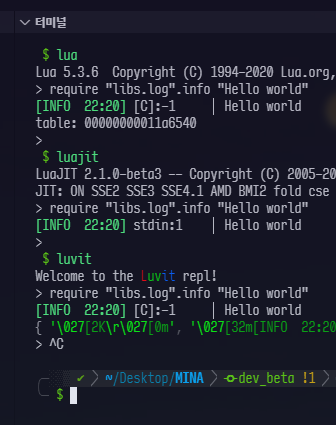
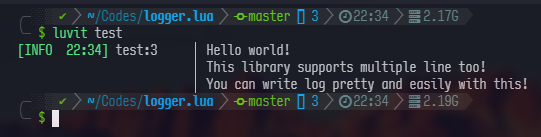
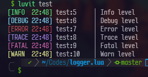
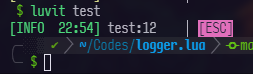
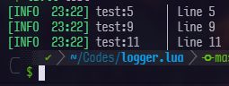
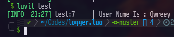
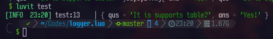

# Hello World!

This library is mono module library, so if you want to use this library, just copy logger.lua into fit of directory in your workspace  
This module is too simple! so it doesn need to described much!

# Features

## Many Lua Platforms

On every lua platform works! this library will detect what you use and select propr base librarys Like below image, it works with lua5.3, luajit, luvit and more!  


## Multiple Lines

It will automatically detect new lines and adding spaces



```lua
_G.require = require -- must be need!
local logger = require "logger"

logger.info("Hello world!\nThis library supports multiple lines too!\nYou can write log pretty and easily with this!")
```

## Many Levels

It supports many levels as default! you can add more levels with editting logger.lua



```lua
_G.require = require -- must be need!
local logger = require "logger"

logger.info("Info level")
logger.debug("Debug level")
logger.error("Error level")
logger.trace("Trace level")
logger.fatal("Fatal level")
logger.warn("Warn level")
```

## Escape Special Characters

It displays special characters as highlighted text



```lua
_G.require = require -- must be need!
local logger = require "logger"

logger.info("\127") -- del key, this is will escaped
logger.info("\27[4mUNDERLINE") -- this is will not escaped
```

## Line Number / File Name

This library supports line number and file name by debug library, you can catch where log message was written!



## Formatting

You don't need to use `logger.info(string.format(...))`, you can do samething with `logger.infof`  
All of levels support this



```lua
_G.require = require -- must be need!
local logger = require "logger"

local user = {}
user.name = "Qwreey"

logger.infof("User Name Is : %s",user.name)
```

## Display Table / Other Types

**WORKS ON ONLY LUVIT**  
This library supports luvit's pretty-print library, so if you pass table info log function, it will automatically dump table into string and show that!



```lua
_G.require = require -- must be need!
local logger = require "logger"

logger.info({qus="It is supports table?",ans="Yes!"})
```

## Appender

TODO: description for appender

## Other Settings

TODO: description for settings
